# ElmSharp

👋 Welcome to ElmSharp.

I came across the [Elm Language](https://elm-lang.org) a few years ago and it has deeply changed the way I approach software. Elm is multiple things: it is a language, it is a package ecosystem and more fundamentally it is an **architecture**.

I do feel, however, that sometimes it is hard to describe to my fellow colleagues how Elm works and what are the rules of the game. So I decided: what better way to show-and-tell than to "create Elm" in csharp.

Why was I so moved by the elm architecture? My experience is that it brings a set of healthy constraints that lead you towards objectively better software: many decisions that would be made later in a software project must be made earlier and more consciously. The practices this architecture enforces (immutability, pureness of functions, unidirectional data flow) align very well with the ultimate goal of having **testable and reliable software**.

The elm architecture is [very well explained in the elm guide](https://guide.elm-lang.org/architecture/) so I will use the bullet points I find more important:

* Your application has one single piece of **state**
* This state is **immutable**: the only way to "move state forward" is via the `Update` function
* The `Update` function is always triggered by a `Message`
* The only way to have a side-effect in the world is via a `Command`
* `Message`s can come from the `View`, from `Subscriptions` or from the result of a `Command`

You can think of a `Message` as a *fact*: "the user clicked on this button", "time has elapsed", "this HTTP request has failed", "the time is now 12:24:00".

You can think of a `Command` as an *intention* to affect or obtain information from the world: "can you please run this HTTP request?", "can you please tell me the time?", "can you please give me a random number between 0 and 100?", "I would like a new Guid, please".

## 📚 What is the implicit loop of an ElmSharp application?

Just like the Elm architecture, there in an implicit loop that ElmSharp's runtime handles for you. From a high level standpoint, it goes something like this:

```mermaid
sequenceDiagram
    ElmSharp->>+User: Init()
    User->>-ElmSharp: state=📦, cmd=🙏
    Note over ElmSharp: ElmSharp remembers<br/>state=📦, cmd=🙏

    opt Subscription management
        ElmSharp->>+User: Subscriptions(state: 📦)
        User->>-ElmSharp: desiredSubs = [⌚, ⌨, ☎]
        Note over ElmSharp: ElmSharp subscribes to<br/>the desired subscriptions,<br/> if any
        ElmSharp-->>+Subs: 👂 Activate subscription(📫)
        Subs-->>-MailBox: ✉ Subscription event
    end

    loop while cmd != StopApp
        ElmSharp-->>+Cmds: 🏃‍♂️ Run command (📫)
        Cmds->>-MailBox: ✉ Cmd result

        ElmSharp->>+User: View(state: 📦, 📫)
        User-->>MailBox: ✉ User performed action
        User->>-ElmSharp: 🎨 View representation

        Note over ElmSharp: ElmSharp renders the view<br/>(only command line<br/>supported, for the time being)

        ElmSharp->>+MailBox: ⌛ Wait for a message...
        MailBox->>-ElmSharp: ✉ Message

        ElmSharp->>+User: Update(msg: ✉, state: 📦)
        User->>-ElmSharp: state=🍺, cmd=🌍
        Note over ElmSharp: ElmSharp remembers<br/>state=🍺, cmd=🌍

        opt Subscription management
            ElmSharp->>+User: Subscriptions(state: 🍺)
            User->>-ElmSharp: desiredSubs = [👮‍♂️, 🚨]
            Note over ElmSharp: ElmSharp compares the delta<br/>before previous subscriptions<br/>and the new desired ones<br/> subscribing to new ones and<br/>unsubscribing from old ones
            ElmSharp-->>Subs: ❌ Unsubscribe
            ElmSharp-->>Subs: 👂 Activate subscription(📫)
        end
    end

    ElmSharp-->>Subs: ❌ Unsubscribe

    ElmSharp->>User: 🚪 Exit with StopApp status code
```



Explaining it on a textual level: when an ElmSharp application starts (User runs `await ElmSharp<Model, Message>.Run(...)`), ElmSharp internally sets up a mailbox (leveraging `System.Threading.Channels`). This mailbox has a `Write` mechanism, called the `dispatcher`. ElmSharp then calls the user's `Init()` function, which returns a `Model` instance and a `Command` to be executed. ElmSharp stores this instance of the `Model` as the current state (the words `Model` and state are used somewhat interchangeably in this document).

Now that ElmSharp has the current state, it once again reaches to the user code via the `Subscriptions` function. This function will return a list of desired subscriptions, so that ElmSharp can perform the wiring up of these subscriptions. Wiring up a subscription consists of creating a new `CancellationTokenSource` per subscription and invoking the internal `Subscribe` method on the subscription instance, which receives a `CancellationToken` and the `dispatcher`. The subscriptions themselves are executed as non awaited `Task`s so they don't block ElmSharp's main loop. A subscription communicates with the user via the aforementioned mailbox (leveraging the `dispatcher`).

ElmSharp now enters a `while(true)` loop. Inside it, ElmSharp first looks at the `Command` returned by the user. If the command is the `StopAppCommand` we break out of the loop, unsubscribe for any existing subscriptions and return from the `await .Run(...)` method with the same status code as requested on the StopAppCommand. Otherwise, this is a normal `Command` and ElmSharp will invoke its `Run` method, much like what happened with the subscriptions, above. One big difference is that while a Subscription has access to the `dispatcher` and therefore can create multiple messages, a `Command` doesn't: a `Command` can only return the appropriate `Message` indicating its success or failures (semantics vary per command, ElmSharp doesn't distinguish between success or failure). This returned messaged is then dispatched to the mailbox. Commands also execute as non awaited `Task`, which means they don't block ElmSharp's loop.

One further step is the `View` function, where ElmSharp once again reaches to user code and provides the current state, as well as the `dispatcher`. This allows the user to build user interfaces which can themselves dispatch messages into ElmSharp's mailbox. The `View` aspect of ElmSharp is still an area under development, and for now only Console Applications are supported. Due to their nature, console applications do not leverage the `dispatcher` of the `View` function.

Finally, ElmSharp will await for a message in the mailbox, which signals that something of interest has happened. Remember, a message can come from the `View`, or the result of a `Command` or from a `Subscription`. Once ElmSharp receives this message, it will invoke the user's `Update` function. This function receives this `Message` as well as the current `Model`. The job of this function, much like the `Init()` function is to return a new instance of the `Model` as well as any `Command` that should be executed.

As the last step, since the `Model` has potentially been modified by the `Update()` function, ElmSharp will once again invoke the `Subscriptions()` function, applying the logic described above . And the loop repeats.

## 🤔 What does it mean creating an ElmSharp application?

There are two worlds in an ElmSharp application: the runtime world and the user world. You are the user, the creator of awesome ElmSharp applications.

As a user, your job consists of:

* Creating a `Model`. For instance, if your application keeps track of "todo" items, your `Model` could be `public record Model(ImmutableList<Todo> Todos);`

* Declaring the list of `Message`s that your application understands. For the simple todo tracking application, we can imagine a few messages: `TodoCreated`, `TodoMarkedInProgress`, `TodoMarkedCompleted` and `TodoDeleted`

* Implementing an `Init` function which tells ElmSharp about the initial state when your application starts

* Implementing the `Subscriptions` function, which is the way that you let ElmSharp know "given my model is currently X, I want to subscribe to these interesting events about the world (or none)"

* Implementing the `View` function which is how you will represent your `Model` to the user. The whole view can only be dependent on data present in the `Model`

* Implementing the `Update` function, which is how you make your model progress, in response to incoming `Message`s

> ℹ More advanced use cases will require you to implement your specific `Command` and `Subscription` but this is something we will cover in a later topic.

## 🧠 Some ground rules

As with any architecture, we can only reap benefits if we follow the ground rules associated with tit. For both Elm and ElmSharp's architecture there is one fundamental ground rule: **immutability**. In Elm this is trivial, because the language itself doesn't have any mutability "escape hatches". C# however, has plenty of those 😅. This means that just like TDD or SOLID enforce certain practices to reap any benefits, ElmSharp's architecture requires the `Model` to be fully immutable. Without this rule, there won't just be dragons, there will be d̵r̴a̵g̴o̸n̸s̶ ̷w̶h̸a̷t̴ ̶i̸s̴ ̴h̴a̵p̶p̶e̴n̷i̴n̴g̸,̴ ̷o̶h̴ ̷n̴o̴o̶o̴. You have been warned 🐲😁

## ❓ How does the code look like?

Assuming the following `GlobalUsings.cs` in your project `UserCode`:

```csharp
// 📃 GlobalUsings.cs
global using Cmd = ElmSharp.ElmSharp<UserCode.Model, UserCode.Message>.Command;
global using Sub = ElmSharp.ElmSharp<UserCode.Model, UserCode.Message>.Subscription;
```

These are the signatures of the important functions:

```csharp
// MODEL (immutable; holds you application state)
public record Model(
    ImmutableDictionary<Guid, Todo> Todos);

// MESSAGE (immutable; communicates facts that happened)
public abstract record Message 
{
    public sealed record TodoCreated(string TodoDescription) : Message { }

    public sealed record TodoMarkedInProgress(Guid TodoId) : Message { }

    public sealed record TodoMarkedCompleted(Guid TodoId) : Message { }

    public sealed record TodoDeleted(Guid TodoId) : Message { }
    // ...;
}

// INIT (pure function; provides the initial state of the app and commands to execute)
public static (Model, Cmd) Init() => /*...*/;

// SUBSCRIPTIONS (pure function; allows you to obtain messages from non-user inputs)
public static ImmutableDictionary<string, Sub> Subscriptions(Model model) => /*...*/;

// VIEW (pure function; given a current model, return a visualization intention)
public static object View(Model model, Action<Message> dispatch) => /*...*/;

// UPDATE (pure function; the only way to move your state forward; gets triggered by incoming messages)
public static (Model, Cmd) Update(Message message, Model model) => message switch
{
    Message.TodoCreated info =>
        model.OnTodoCreated(info),

    Message.TodoMarkedInProgress info =>
        model.OnTodoMarkedInProgress(todoId: info.TodoId),

    Message.TodoMarkedCompleted info =>
        model.OnTodoMarkedCompleted(todoId: info.TodoId),

    Message.TodoDeleted info =>
        model.OnTodoDeleted(todoId: info.TodoId),
    //...
}
// ...

// Using extension methods (pure functions) on Model, to allow for a cleaner looking Update function
internal static (Model, Cmd) OnTodoDeleted(
    this Model model, 
    Guid todoId) => 
        (model with { Todos = model.Todos.Remove(todoId) }, Cmd.None);
// ...
```

For a simple project, you can expect your source tree to look something like this:

```
GlobalUsings.cs
Init.cs
Message.cs
Model.cs
Program.cs
Subscriptions.cs
Update.cs
View.cs
```

---

## 📚 Learning & Examples

[🍀 Guessing Game](https://github.com/CodeFab-io/ElmSharp/blob/main/examples/GuessingGame/)

---

I hope you enjoy using ElmSharp, as much as I enjoyed creating it.

Made by someone who ♥ building things.